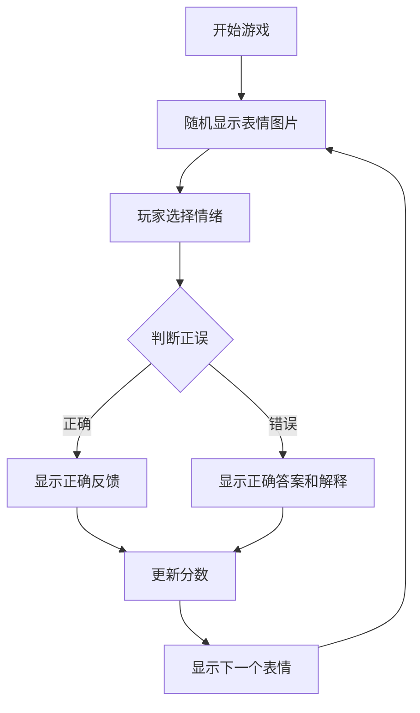

# guess-expression
Emotion Recognition Training Game - Helping Individuals with Asperger's Improve Facial Expression Recognition

# 情绪识别训练游戏 - 帮助阿斯伯格综合征患者提升表情识别能力

## Emotion Recognition Training Game - Helping Individuals with Asperger's Improve Facial Expression Recognition

## 简介

这个基于网页的游戏旨在帮助阿斯伯格综合征(ASD)患者提高识别和理解面部表情的能力。游戏基于Karolinska定向情绪面孔(KDEF)数据库的科学研究，该数据库经过严格验证，包含490张不同情绪的面部表情照片。

## 游戏特点

- **科学基础**：使用经过验证的情绪面孔图片
- **渐进式学习**：从基本情绪开始逐步增加难度
- **即时反馈**：每次选择后提供正确答案和解释
- **表情模仿**：提供每种情绪的具体面部肌肉运动描述
- **无障碍设计**：简洁界面，适合ASD用户

## 如何开始

1. 克隆或下载本仓库
2. 打开`guess_expression.html`文件（无需服务器）
3. 点击"开始游戏"按钮
4. 观察显示的面部表情
5. 从选项中选择你认为正确的情绪
6. 查看反馈并学习正确识别表情

## 情绪描述与模仿指南

以下是游戏中包含的七种基本情绪及其面部特征描述，可帮助ASD用户理解和模仿：

### 😠 愤怒 (Angry)
- **眉毛**：向下并聚拢
- **眼睛**：瞪大，上眼睑抬起
- **嘴巴**：嘴唇紧闭或张开呈方形
- **肌肉**：皱眉肌收缩，降眉间肌紧张

### 😨 恐惧 (Fearful)
- **眉毛**：抬起并聚拢
- **眼睛**：上眼睑抬起，露出更多眼白
- **嘴巴**：张开，嘴角向后拉
- **肌肉**：额肌收缩，颈阔肌活动

### 🤢 厌恶 (Disgusted)
- **鼻子**：皱起
- **上唇**：抬起并卷曲
- **下唇**：可能抬起或突出
- **肌肉**：提上唇肌和鼻肌收缩

### 😊 快乐 (Happy)
- **眼睛**：外眼角出现"鱼尾纹"
- **嘴巴**：嘴角向上向后拉起
- **脸颊**：向上抬起
- **肌肉**：颧大肌和眼轮匝肌收缩

### 😢 悲伤 (Sad)
- **眉毛**：内角向上抬起
- **眼睛**：上眼睑下垂
- **嘴角**：向下拉
- **肌肉**：皱眉肌和降口角肌活动

### 😲 惊讶 (Surprised)
- **眉毛**：高高抬起并弯曲
- **眼睛**：睁大，露出虹膜上方的眼白
- **嘴巴**：张开呈椭圆形
- **肌肉**：额肌和提上睑肌收缩

### 😐 中性 (Neutral)
- **面部**：放松无表情
- **肌肉**：无明显活动
- **特征**：平静的注视

## 为什么这个游戏对ASD有帮助

阿斯伯格综合征患者通常在识别面部表情方面存在困难。这个游戏通过：

1. 提供清晰、标准化的表情示例
2. 分解表情的肌肉运动成分
3. 提供即时反馈和重复练习机会
4. 逐步增加识别难度
5. 减少社交压力，在安全环境中学习

## 科学依据

游戏使用的所有面部表情图片来自经过科学验证的Karolinska定向情绪面孔(KDEF)数据库，该数据库具有以下特点：

- 490张高质量彩色照片
- 7种基本情绪（愤怒、恐惧、厌恶、悲伤、快乐、惊讶、中性）
- 70位不同演员（35男35女）
- 正面视角，去除发际线干扰
- 每种情绪都有命中率和强度评分

研究显示，快乐表情最易识别（命中率92.65%），恐惧表情最难识别（命中率43.03%）。中性表情的唤醒度最低（2.67/9）。

## 游戏开发

## 贡献与改进

欢迎通过GitHub提出改进建议或提交代码。特别需要帮助的领域：
- 添加更多表情描述细节
- 改进无障碍功能
- 增加多语言支持
- 开发进阶训练模式

## 许可证

本项目采用[MIT许可证](LICENSE.md)

## 参考文献

Goeleven, E., De Raedt, R., Leyman, L., & Verschuere, B. (2008). The Karolinska Directed Emotional Faces: A validation study. Cognition & Emotion, 22(6), 1094-1118.

Ekman, P., & Friesen, W. V. (1976). Pictures of facial affect. Palo Alto, CA: Consulting Psychologists Press.